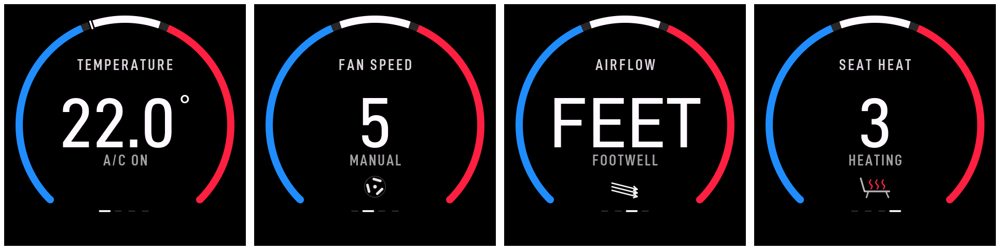

# Smart Dial


Smart Dial is a compact automotive control interface built around a rotary
encoder, physical buttons and a round AMOLED display. It is being developed as
a bachelor-project proof of concept, with the current phase focused on the
mechanical design and a responsive, readable user interface.



The prototype uses the
[Waveshare ESP32-S3-Touch-AMOLED-1.32](https://www.waveshare.com/esp32-s3-touch-amoled-1.32.htm),
a custom 3D-printed mechanism and an Arduino_GFX-based interface. The control
target is intentionally still flexible; the next application will be selected
with the project supervisor after the interaction concept has been evaluated.

## What works now

- Fast rotary input with a press and long-press action
- Four automotive-style pages: temperature, fan, airflow and seat heating
- Partial display updates for snappy value changes
- Animated fan and clean page transitions
- A trail-free startup sequence built around the OJM Systems logo
- A custom housing, geared rotating ring and screw-mounted display carrier
- A restrained black, white, red and blue visual system

## Hardware

The current prototype is based on:

- Waveshare ESP32-S3-Touch-AMOLED-1.32, 466 × 466 pixels
- Rotary encoder with an integrated push button
- Four 6 × 6 × 6 mm tactile switches
- Custom 3D-printed fixed and rotating parts
- M3 heat-set inserts and black machine screws for the upper cover

The detailed parts list is in [docs/BOM.md](docs/BOM.md). Display and input pin
assignments are documented in [docs/WIRING.md](docs/WIRING.md).

## Controls

| Action | Result |
|---|---|
| Rotate | Move between pages |
| Short press | Enter or leave value editing |
| Rotate while editing | Change the active value |
| Long press | Turn the climate interface on or off |

## Firmware setup

### Requirements

- Arduino IDE 2.x
- Espressif ESP32 board package
- **GFX Library for Arduino** (`Arduino_GFX_Library`)
- **ESP32Encoder**
- **LVGL 8.x**, used only as a compatibility layer for the generated logo asset

The firmware expects the OJM Systems image asset `logomodre256.c`. This file is
not included in this starter package. Copy your existing asset into
`firmware/SmartDial/` before compiling. The Arduino sketch directory should
then contain:

```text
firmware/SmartDial/
├── SmartDial.ino
├── SmartDial_Fonts_DINish.h
└── logomodre256.c
```

### Arduino IDE settings

| Setting | Value |
|---|---|
| Board | ESP32S3 Dev Module |
| USB CDC On Boot | Enabled |
| CPU Frequency | 240 MHz (WiFi) |
| Core Debug Level | None |
| USB DFU On Boot | Disabled |
| Erase All Flash Before Sketch Upload | Disabled |
| Events Run On | Core 1 |
| Flash Mode | QIO 80 MHz |
| Flash Size | 8 MB (64 Mb) |
| Arduino Runs On | Core 1 |
| Partition Scheme | Huge APP (3 MB No OTA / 1 MB SPIFFS) |
| PSRAM | OPI PSRAM |
| Upload Mode | UART0 / Hardware CDC |
| Upload Speed | 921600 |

Open `firmware/SmartDial/SmartDial.ino`, select the correct serial port, compile
and upload. A successful startup begins with this serial message:

```text
BOOT: Smart Dial v0.1.0-poc
```

## Rendering approach

Normal interaction does not redraw the complete 466 × 466 frame. The firmware
keeps base and working framebuffers in PSRAM, updates only the affected region
and transfers RGB565 data over the 80 MHz QSPI display bus. TE synchronization
is used where it helps prevent visible tearing. Arduino_GFX handles the runtime
UI; LVGL is only needed to read the existing logo descriptor.

## Repository layout

```text
smart-dial/
├── firmware/SmartDial/    Arduino firmware and font data
├── hardware/              Current printable exports and CAD notes
├── docs/                  BOM, wiring, images and development notes
├── licenses/              Third-party font license
├── CHANGELOG.md           Public version history
└── README.md
```

## Project status

This is a functional proof of concept, not a production automotive component.
The current public milestone is `v0.1.0-poc`. Local experiments made before the
repository was created are kept offline; Git history starts from the first
coherent version instead of publishing every test sketch.

Next planned work:

- Validate the new printed housing and upper cover
- Photograph and record the assembled prototype
- Select the final control use case with the project supervisor
- Replace remaining placeholder BOM entries with exact part numbers
- Document the final wiring and assembly sequence

See [docs/DEVELOPMENT.md](docs/DEVELOPMENT.md) for the short development history.

## Project support

The display hardware used for this prototype was provided by Waveshare.
Prototype assembly and bench work have also been supported with tools from
Miniware, Fanttik and iFixit. KORAD has confirmed support with a KA3005PS
bench power supply; the unit is still awaiting shipment and has not been used
for the current prototype.

The complete and deliberately transparent disclosure is in
[docs/SPONSORS.md](docs/SPONSORS.md). Sponsors supplied hardware or tools and
did not control the design, source code or project conclusions.

## License

No source-code or hardware license has been selected yet. Until a license is
added, the project remains under default copyright. This is intentional while
publication terms are being confirmed with the project supervisor.

The bundled DINish font data is separately distributed under the SIL Open Font
License 1.1. See [licenses/DINish-OFL-1.1.txt](licenses/DINish-OFL-1.1.txt).

